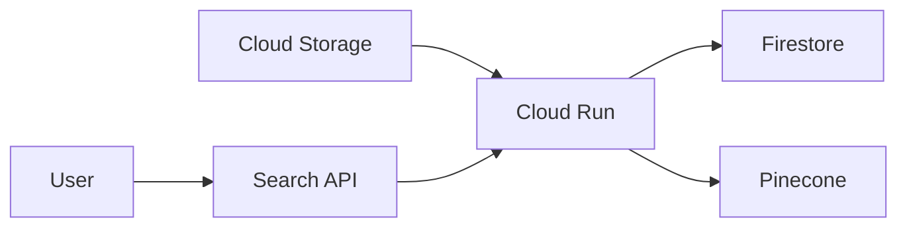

# Document Processing and Search Engine 🚀

## Overview

The document processing and search engine is built with FastAPI, Google Cloud services, and Pinecone. It efficiently extracts text from PDFs, generates embeddings, and provides a fast, intelligent search functionality.

## Features

- 📄 PDF text extraction using PyMuPDF
- 🧠 Text embedding generation with Sentence Transformers
- 🔍 Intelligent search using Pinecone vector database
- ☁️ Seamless integration with Google Cloud Storage, Google Cloud Run, Google Pub/Sub and Firestore
- 🔐 Secure secret management with Google Cloud Secret Manager

## Architecture



## Quick Start

1. Clone the repository
2. Set up your Google Cloud Project and Pinecone account
3. Configure environment variables
4. Deploy to Google Cloud Run

```bash
make deploy_cloud_run

make setup_pubsub

make build_frontend
```

## API Endpoints

- `POST /`: Process a document
- `POST /search`: Search processed documents
- `POST /log`: Log requests

## Technologies Used

- FastAPI
- Google Cloud Run
- Google Cloud Storage
- Google Cloud Firestore
- Google Cloud Secret Manager
- Pinecone
- Sentence Transformers
- PyMuPDF

## License

This project is licensed under the MIT License - see the [LICENSE](LICENSE) file for details.