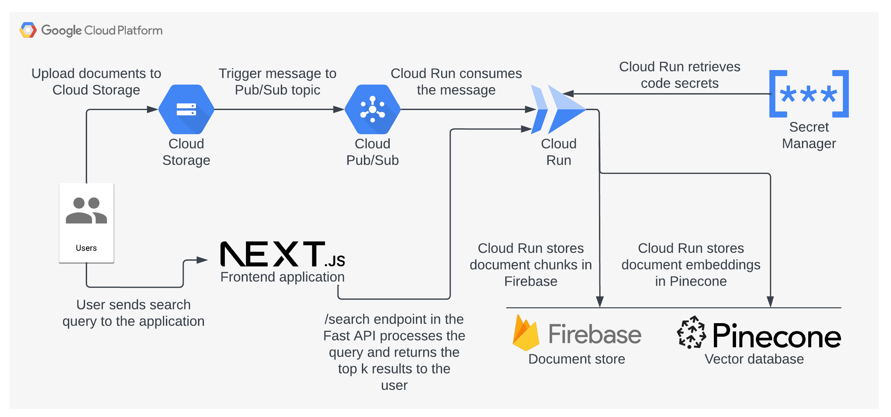
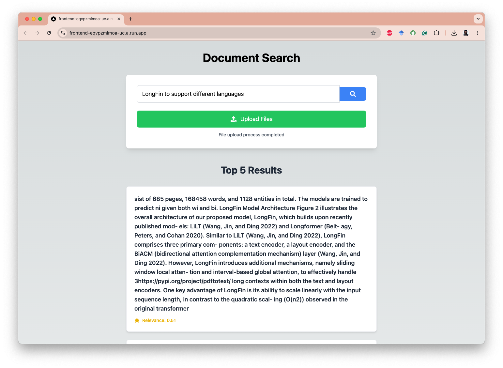

# Document Processing and Search Engine 🚀

## Overview

The document processing and search engine is built with FastAPI, Google Cloud services, and Pinecone. It efficiently extracts text from PDFs, generates embeddings, and provides a fast, intelligent search functionality.

## Features

- 📄 PDF text extraction using PyMuPDF
- 🧠 Text embedding generation with Sentence Transformers
- 🔍 Intelligent search using Pinecone vector database
- ☁️ Seamless integration with Google Cloud Storage, Google Cloud Run, Google Pub/Sub and Firestore
- 🔐 Secure secret management with Google Cloud Secret Manager


## Quick Start

1. Clone the repository
2. Set up your Google Cloud Project and Pinecone account
3. Configure environment variables
4. Deploy to Google Cloud Run

```bash
make deploy_cloud_run

make setup_pubsub

make build_frontend
```

## API Endpoints

- `POST /`: Process a document
- `POST /search`: Search processed documents
- `POST /log`: Log requests

## Technologies Used

- FastAPI
- Google Cloud Run
- Google Cloud Storage
- Google Cloud Firestore
- Google Cloud Secret Manager
- Pinecone
- Sentence Transformers
- PyMuPDF

## System Architecture

Our document processing and search engine system is built on a robust, scalable architecture leveraging various Google Cloud services and other technologies. Here's an overview of our system architecture:



*Figure 1: High-level system architecture*


### Google Cloud Run
Cloud Run is a fully managed serverless platform that automatically scales your stateless containers. A key advantage is its ability to scale to zero when not in use, significantly reducing costs in production environments. When there are no incoming requests, Cloud Run scales down to zero instances, meaning you're not paying for idle resources. As soon as a request comes in, it quickly spins up a container to handle it, usually within seconds.

### Google Cloud Storage
Used for storing the original PDF documents. It provides secure, durable, and highly available object storage, making it ideal for handling large volumes of unstructured data like PDFs.

### Google Cloud Firestore
A flexible, scalable NoSQL cloud database to store and sync data in real-time. In this project, it's used to store the text chunks and their corresponding embedding IDs, providing quick access for search results.

### Google Cloud Pub/Sub
A fully-managed real-time messaging service that allows you to send and receive messages between independent applications. It's used here to trigger the document processing function when new documents are uploaded to Cloud Storage.

### Google Cloud Secret Manager
Provides a secure and convenient method for storing and accessing your project's sensitive data, such as API keys. It's used in this project to securely store and retrieve the Pinecone API key.

### Pinecone
A vector database that provides a fast, scalable solution for storing and querying high-dimensional vectors. It's used here to store and query the document embeddings, enabling efficient semantic search.

### FastAPI
A modern, fast (high-performance) web framework for building APIs with Python. It's used to create the API endpoints for document processing and search functionality.

### Sentence Transformers
A Python framework for state-of-the-art sentence, text and image embeddings. In this project, it's used to generate embeddings from the extracted text chunks.

### PyMuPDF
A high-performance PDF library used for extracting text from PDF documents. It provides robust capabilities for handling various PDF formats and structures.


## Frontend User Interface

Our document search system features a user-friendly frontend interface built with Next.js. The frontend allows users to input queries and displays search results efficiently.



*Figure 2: Frontend interface of the document search system*

Key features of the frontend:
- Search bar supporting multiple languages
- Prominent search button for query submission
- Display of top 5 results with relevance scores
- Clean, intuitive design for easy navigation

The frontend interacts with a sophisticated backend system that processes queries and retrieves relevant document snippets, leveraging advanced natural language processing techniques to understand and match user intent with document content.

## Cost Efficiency

By leveraging Cloud Run's ability to scale to zero, this architecture ensures cost-efficiency in production. You only pay for the actual compute time used to process requests, not for idle time. This makes it an excellent choice for applications with variable or unpredictable traffic patterns, allowing you to handle high loads when needed while minimizing costs during quiet periods.